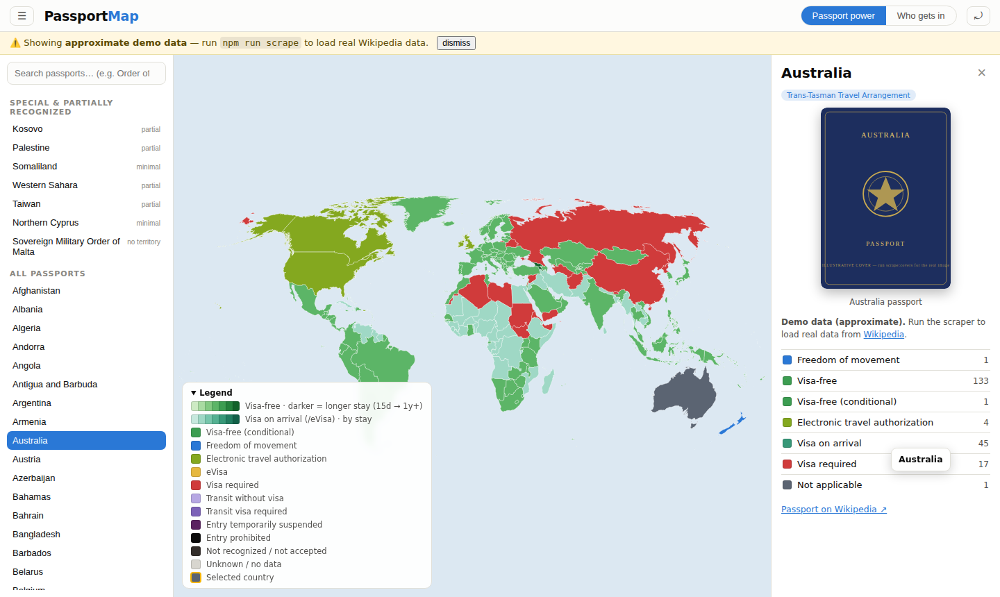
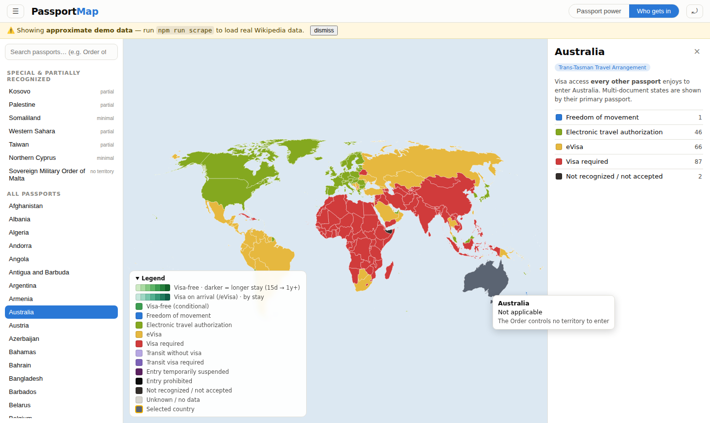

# PassportMap

A world-map web app for exploring the power of every passport and travel document on Earth — visa requirements, freedom of movement, and entry rights between any two countries.



Click any country to see what its passport grants everywhere else. Toggle to **“Who gets in”** to flip the question: which passports can enter *this* country?



## Quick start

```sh
npm install
npm run seed      # generate demo data + map + entities (already committed)
npm run dev       # → http://localhost:5173

# production
npm run build
npm run serve     # serves dist/ + records analytics → http://localhost:8787
```

The repo ships with **clearly-labelled approximate demo data** (a banner says so in the app) so everything is explorable immediately. To load real data:

```sh
npm run scrape          # ~200 Wikipedia pages, randomized polite delays (~1 h)
npm run scrape:covers   # real passport cover images from Wikipedia
npm run build:data      # rebuild entities.json + matrix.json
```

Scraped files are stamped `source: "wikipedia"` and are never overwritten by the demo seeder.

## How it works

| Piece | File(s) | Notes |
|---|---|---|
| **Master registry** | `tools/registry.mjs` | Single source of truth: every issuing entity, its travel documents, Wikipedia page names, blocs, recognition level. Everything else derives from it. |
| **Our own map** | `public/data/map/world.json`, `tools/build-map.mjs` | A committed, editable GeoJSON owned by this repo (see below). |
| **Visa data** | `data/access/*.json` → `public/data/matrix.json` | One file per travel document; `npm run build:matrix` merges them (plus `data/overrides/`) into the compact matrix the app loads. |
| **Frontend** | `src/` | Vite + TypeScript + d3-geo. No framework. |
| **Scraper** | `scraper/` | Wikipedia table + cover-image scrapers, status normalizer, seeder. |
| **Analytics** | `src/analytics.ts`, `server/analytics-server.mjs` | See below. |
| **Monthly refresh** | `.github/workflows/refresh-data.yml` | Scheduled GitHub Action re-scrapes and commits the diff. |

### Adding / removing a country (geopolitics changes)

Everything is data-driven, so e.g. if Northern Cyprus dissolved tomorrow:

1. Delete its row (`NCY`) in `tools/registry.mjs`.
2. Reassign or remove its polygon via `MAP_OVERRIDES` in `tools/build-map.mjs` (`reassign: { 'n-cyprus': 'CYP' }`).
3. `npm run seed` (or `npm run build:data` if you have scraped data). Done.

Adding a new state is the same in reverse: add a registry row, make sure a map feature exists (split a polygon in any GeoJSON editor, or add one under `MAP_OVERRIDES.add`), rebuild.

Entities without territory (Sovereign Military Order of Malta) simply have `features: []` — they appear in the left-hand passport list instead of on the map. Multi-document states (Israel's Darkon + Teudat Ma'avar) list several `documents`, and the sidebar shows a tab per document.

### “Use my own world map” — how the map is made (open question #1)

You don't need to hire a cartographer, and you shouldn't ask an AI to draw coastlines freehand (it can't do it accurately). The practical answer, implemented here:

- **Seed from public-domain geometry.** Natural Earth (via the `world-atlas` package) is public domain and already draws partially recognized states — Northern Cyprus, Somaliland, Kosovo, Taiwan, Palestine, Western Sahara — as separate polygons. `tools/build-map.mjs` converts it into `public/data/map/world.json` keyed by **our** entity IDs.
- **Then the file is ours.** It's committed, human-readable GeoJSON. Edit it with [mapshaper.org](https://mapshaper.org) or geojson.io — split polygons for new de-facto states, delete dissolved ones — or express changes as code in `MAP_OVERRIDES`. The upstream package is only a bootstrap; nothing at runtime depends on it.
- AI *is* useful here for the mechanical parts (writing the override entries, splitting geometries by a boundary line) — just not for inventing geography.

### Color scheme

Statuses follow the product spec, validated for colour-vision-deficiency separation with the palette validator (worst adjacent pair ΔE 9.7, mitigated by tooltips, the sidebar's per-status country lists, the legend and polygon strokes):

- **Visa-free & visa on arrival** — green / teal ramps where **darker = longer stay** (Mexico's 180 days in the UAE renders visibly darker than Ireland's 30).
- **eVisa** — amber (“a little less green”); **ETA** — yellow-green between the two.
- **Freedom of movement** (EU/EEA/CH, GCC, CTA, Trans-Tasman, CA-4, Mercosur, ECOWAS, EAC) — bright blue.
- **Entry prohibited / not recognized** — black / near-black; **visa required** — red; conditional visa-free — hatched; unknown — gray.
- The selected country gets a gold outline.

Light and dark mode both supported (`prefers-color-scheme`).

## Data population via scraping

`scraper/scrape.mjs` walks every document in the registry and fetches its
`https://en.wikipedia.org/wiki/Visa_requirements_for_<nationality>_citizens` page **sequentially at randomized intervals** (`SCRAPE_DELAY × (0.5 + rand)`, default ≈ 8–24 s per page), with a descriptive `PassportMapBot` User-Agent per Wikipedia's robot policy. The full world takes about an hour — deliberately slow and undramatic. Parsed rows are normalized (`scraper/statuses.mjs`) into 15 canonical statuses plus allowed-stay days.

Wikipedia is imperfect for edge cases (it has no separate Teudat Ma'avar table, SMOM acceptance is scattered), so `data/overrides/*.json` holds curated corrections that `build-matrix` applies last — see `data/overrides/ISR-teudat-maavar.json`.

### Automated monthly refresh (open question #2)

**No Mac mini or agent farm needed.** Scraping ~200 pages once a month is roughly one hour of near-zero compute; any machine can do it, including:

- **GitHub Actions (recommended, free):** `.github/workflows/refresh-data.yml` runs on the 3rd of each month, re-scrapes anything older than 20 days, refreshes covers, rebuilds the matrix, and commits the diff. `workflow_dispatch` lets you trigger it manually, optionally for specific documents.
- **A regular Mac:** `crontab -e` → `23 4 3 * * cd ~/passportmap && npm run scrape && npm run build:data`. A Mac mini would work too — it's just massively overqualified.

## Analytics

The client (`src/analytics.ts`) beacons `pageview`, `select_country`, `select_document`, `toggle_view` and `search` events to `/api/events`. The bundled zero-dependency server (`server/analytics-server.mjs`) logs each event to `data/analytics/events-YYYY-MM.jsonl` with:

- **when** — server timestamp per event,
- **which countries they click** — entity id + view in the event props,
- **where their IP is listed** — the client IP (`X-Forwarded-For`-aware) plus the CDN geo header (`CF-IPCountry` / `X-Vercel-IP-Country`) when deployed behind Cloudflare/Vercel, avoiding external geo-lookup calls.

`GET /api/stats` returns live aggregates; `npm run stats` prints a CLI report. Prefer a hosted product? Set `VITE_ANALYTICS_ENDPOINT` and skip the server. If the site serves EU visitors, remember an analytics/privacy notice — IP addresses are personal data under GDPR.

## Honest-data policy

Every access file carries its provenance. Seeded demo files are `source: "seed", approximate: true` and trigger the in-app warning banner; scraped files are `source: "wikipedia"` with URL + timestamp shown in the sidebar. The seeder refuses to overwrite scraped data.
